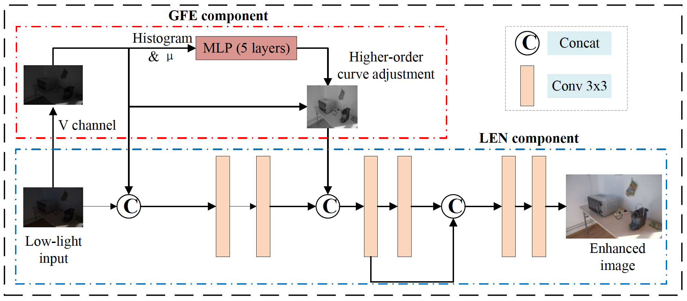

# FLW-Net

A PyTorch implementation of _[arXiv 2023 paper](https://arxiv.org/abs/2304.02978), "A Fast and Lightweight Network for Low-Light Image Enhancement"_

> Note that this repo is _NOT_ the official implementation to the paper. Click [here](https://github.com/hitzhangyu/FLW-Net) to goto the official implementation.



## Requirements

- Python >= 3.6
- PyTorch
- requirements.txt

## Dataset Preparation

This repo uses the LOL dataset for training and evaluation. It expects the following directory structure:

```
|-- LOL
    |-- our485
        |-- low
            |-- 1.png
            ...
        |-- high
            |-- 1.png
            ...
    |-- eval15
        |-- low
        |-- high
```

## Quickstart

```bash
# training
python train.py --data_path

# testing
python test.py --ckpt_path ${CKPT_PATH}
```
